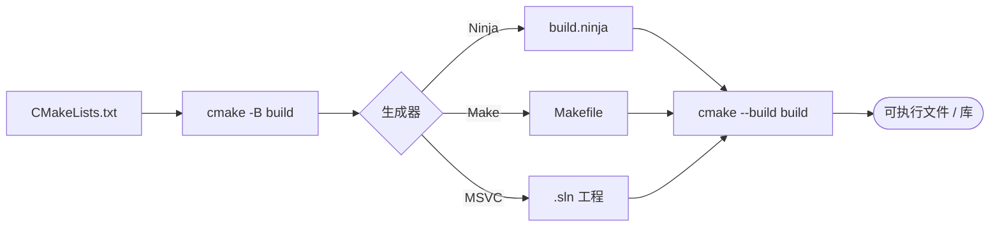

<!-- more -->

## 一、前言

手写 `g++ main.cpp -o app` 编译一两个文件还行，项目一多，改一个头文件就要重新敲一大串命令，换到 Windows 上还得换成 MSVC 的参数。CMake 就是为了解决这个问题：你只描述**项目由哪些文件组成**，剩下的由 CMake 生成对应平台的构建文件（Linux 生成 Makefile/Ninja，Windows 生成 VS 工程）。

## 二、安装

```bash
# Arch / Manjaro
sudo pacman -S cmake ninja

# Ubuntu / Debian
sudo apt install cmake ninja-build

# macOS
brew install cmake ninja
```

验证：

```bash
cmake --version
```


本篇示例统一用 Ninja 作为生成器（比 Make 快），用 Make 也完全一样，把 `-G Ninja` 去掉即可。


## 三、核心概念

| 概念 | 含义 |
| --- | --- |
| `CMakeLists.txt` | 项目的构建描述文件，CMake 的“源代码” |
| 生成器（Generator） | 把 CMakeLists 翻译成 Makefile / VS 工程 |
| Target（目标） | 一个可执行文件或库，是 CMake 的基本单位 |
| 构建目录（build） | 存放生成结果，习惯单独建 `build/`，不污染源码 |
| `PRIVATE` / `PUBLIC` | 依赖的作用范围，决定要不要传给下游 |


CMake 只做两件事：**定义 target**，以及**告诉 target 依赖谁**。


### 构建流程



CMake 本身不编译代码，它只负责把 `CMakeLists.txt` 翻译成对应平台的原生构建文件，真正干活的是 Ninja / Make / MSVC。

## 四、第一个项目

目录结构：

```text
hello/
├── CMakeLists.txt
└── main.cpp
```

`main.cpp`：

```cpp
#include <iostream>

int main() {
    std::cout << "Hello CMake!" << std::endl;
    return 0;
}
```

`CMakeLists.txt`：

```cmake
cmake_minimum_required(VERSION 3.20)   # 最低 CMake 版本
project(hello LANGUAGES CXX)           # 项目名与语言

set(CMAKE_CXX_STANDARD 17)             # 使用 C++17
set(CMAKE_CXX_STANDARD_REQUIRED ON)

add_executable(hello main.cpp)         # 定义可执行目标
```

编译运行：

```bash
cmake -B build -G Ninja   # 配置：在 build/ 生成构建文件
cmake --build build       # 编译
./build/hello
```


推荐始终用 `cmake -B build` + `cmake --build build` 这两条命令，它对所有生成器都通用，不需要 `cd build && make`。


## 五、多文件与子目录

文件一多，就把源码放进 `src/`，每个子目录各写一个 `CMakeLists.txt`：

```text
project/
├── CMakeLists.txt
├── include/
│   └── math.h
└── src/
    ├── CMakeLists.txt
    └── math.cpp
```

顶层 `CMakeLists.txt`：

```cmake
cmake_minimum_required(VERSION 3.20)
project(calc LANGUAGES CXX)

set(CMAKE_CXX_STANDARD 17)
set(CMAKE_CXX_STANDARD_REQUIRED ON)

add_subdirectory(src)   # 交给子目录处理
```

`src/CMakeLists.txt`：

```cmake
add_executable(calc main.cpp math.cpp)

# 头文件目录：PRIVATE 表示只给自己用，不传给依赖方
target_include_directories(calc PRIVATE ${CMAKE_SOURCE_DIR}/include)
```

## 六、编译库并链接

把公共代码做成库，方便复用：

```cmake
add_library(math STATIC math.cpp)
target_include_directories(math PUBLIC ${CMAKE_CURRENT_SOURCE_DIR}/include)

add_executable(calc main.cpp)
target_link_libraries(calc PRIVATE math)   # 自动带上 math 的头文件路径
```

`add_library` 的 `STATIC` 是静态库（`.a`/`.lib`），`SHARED` 是动态库（`.so`/`.dll`）。


`PUBLIC` 的头文件目录会随 `target_link_libraries` 自动传给使用方，这正是为什么 `calc` 不需要再写一次 `target_include_directories`。作用域用错是新手最常见的坑：只给自己用写 `PRIVATE`，接口暴露给下游写 `PUBLIC`。


## 七、引入第三方库

现代 CMake 的标准做法是 `find_package` + `target_link_libraries`：

```cmake
find_package(Threads REQUIRED)
target_link_libraries(calc PRIVATE Threads::Threads)

# 以 fmt 为例，vcpkg / 系统安装了即可找到
find_package(fmt REQUIRED)
target_link_libraries(calc PRIVATE fmt::fmt)
```

找不到包时，把第三方库源码直接放进项目并用 `add_subdirectory(third_party/fmt)` 也可以。

## 八、编译选项与条件配置

```cmake
# 只对某个 target 加警告参数，不要全局 set(CMAKE_CXX_FLAGS ...)
target_compile_options(calc PRIVATE -Wall -Wextra)

# Debug 模式额外定义宏
target_compile_definitions(calc PRIVATE $<$<CONFIG:Debug>:DEBUG=1>)

# 按平台区分
if(WIN32)
    target_link_libraries(calc PRIVATE ws2_32)
elseif(UNIX)
    target_link_libraries(calc PRIVATE pthread)
endif()
```

构建类型在配置时指定：

```bash
cmake -B build -G Ninja -DCMAKE_BUILD_TYPE=Release
```

## 九、常用命令速查

| 命令 | 作用 |
| --- | --- |
| `cmake -B build` | 配置（生成构建文件） |
| `cmake --build build` | 编译 |
| `cmake --build build -j8` | 并行编译 |
| `cmake -B build -DCMAKE_BUILD_TYPE=Debug` | 指定构建类型 |
| `cmake --build build --target clean` | 清理 |
| `rm -rf build` | 彻底重来（改缓存变量后常用） |

## 十、学习建议

- [ ] 用 CMake 重构一个自己写过的小项目
- [ ] 理解 `PRIVATE` / `PUBLIC` / `INTERFACE` 的区别
- [ ] 学会用 `find_package` 引入第三方库
- [ ] 了解 `install()` 与 `CTest` 单元测试集成
- [ ] 进阶：`FetchContent`、`presets`（`CMakePresets.json`）

### 推荐资源

- [CMake 官方文档](https://cmake.org/documentation/)
- [菜鸟教程 CMake 教程](https://www.runoob.com/cmake)（中文，适合零基础）
- [CMake 官方教程（Getting Started）](https://cmake.org/cmake/help/latest/guide/tutorial/index.html)
- [An Introduction to Modern CMake](https://cliutils.gitlab.io/modern-cmake/)

## 十一、总结

CMake 的核心就三句话：**用 `add_executable` / `add_library` 定义 target，用 `target_*` 系列命令给 target 加属性，用 `target_link_libraries` 表达依赖**。掌握这些之后，剩下的都是查文档的功夫。

先把手头项目的编译命令搬进 `CMakeLists.txt`，比死记语法有效得多。有问题欢迎留言交流。

